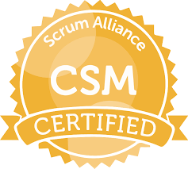

Hi there! ٩(｡•́‿•̀｡)۶ My Name is Chi!
Customer Experience Advocate, Operations Guru, Salesforce Wizard
 
📫 How to reach me: cyson78@gmail.com | 😄 Pronouns: She/Her | 🗻 Southerner in the West Coast | 🌹 Portland, Oregon 
 
 
🧙‍♀️ Certified: Certified Scrum Master, 6X Certified Salesforce Consultant/Administrator - Admin, Advanced Admin, Sales, Service, Platform & Field Service 
 
🌱 Currently Learning: 
<ul>
  <li>Putting together this README</li>
  <li>Re-familiarizing myself with GitHub</li>
  <li>HTML/CSS - to bring my github resume back to life</li>
  <li>Tackling Javascript</li>
  <li>Playing around with my Tesla Light Show</li>
</ul> 
  

Education: 
🖍️ University of North Texas - Class of 2008 | 📓 B.A. Speech Pathology/Early Childhood Development
 
🖍️ Texas &AM University - Class of 2015 | 📓 M.S. Technology & Engineering Management

Certification: 

Social Media: 
     

